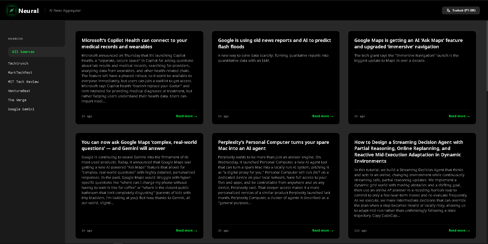

# NEURAL - AI News Aggregator

NEURAL is a lightweight, modern, and high-performance daily aggregator for the latest Artificial Intelligence news. Built entirely with Vanilla JavaScript, HTML, and Tailwind CSS, it automatically pulls and formats RSS feeds from the world's most reputable tech publications into a sleek, fast, and easy-to-read interface.



## ✨ Features

- **🌐 Live RSS Aggregation**: Fetches real-time AI news directly from multiple sources via RSS parsing.
- **⚡ Zero Dependencies**: Pure Vanilla JS architecture. No React, Vue, or Angular overhead, resulting in instant load times.
- **🎨 Modern UI/UX**: Designed with a tech-focused dark mode aesthetic, neon glows, and micro-animations styled entirely with Tailwind CSS.
- **📱 Responsive Layout**: Fully optimized for desktop, tablet, and mobile viewing.
- **🔄 Progressive Translation**: Built-in support to read articles in both English and Portuguese. Translations are fetched dynamically with an animated cascading matrix effect without reloading the page.
- **🛡️ Secure & Robust**: Includes native XSS (Cross-Site Scripting) prevention, smart text truncation for balancing oversized payloads, and staggered network requests to bypass API rate limiting.
- **♿ Accessible**: ARIA-labeled buttons and semantic structure for screen readers.
- **🔮 Skeleton Loading**: Animated skeleton states ensure a smooth user experience even while feeds are being loaded over the network.

## 📰 Supported Sources

NEURAL aggregates news from the top tech publishers focusing on Artificial Intelligence:
- TechCrunch
- MarkTechPost
- MIT Technology Review
- VentureBeat
- The Verge
- Google Gemini (Official Blog)

## 🚀 Getting Started

Since NEURAL requires zero build tools or complex local environments, running the project is incredibly straightforward.

### Prerequisites

You only need an HTTP Server to run it locally (due to CORS rules in modern browsers). 

* If you use [Node.js](https://nodejs.org/), you can use `http-server`, `live-server`, or Vite.
* If you use **VS Code**, you can just use the [Live Server Extension](https://marketplace.visualstudio.com/items?itemName=ritwickdey.LiveServer).

### Installation

1. Clone the repository:
   ```bash
   git clone https://github.com/your-username/NEURAL.git
   ```

2. Navigate to the project directory:
   ```bash
   cd NEURAL
   ```

3. Start your local server:
   - *Using npm/npx:*
     ```bash
     npx serve
     ```
   - *Using VS Code:* 
   Right-click on `index.html` and select **"Open with Live Server"**.

4. Open your browser and go to the provided localhost URL (e.g. `http://localhost:3000`).

## 🛠️ Built With

- **HTML5 & Vanilla JavaScript (ES6+)** - Core structure and logic.
- **Tailwind CSS (via CDN)** - Styling, theme configuration, and responsive design.
- **MyMemory API** - Machine translation without API keys.
- **CORS Proxies** - Fetching cross-origin RSS data securely and bypassing strict server blockades.

## 🤝 Contributing

Contributions, issues, and feature requests are welcome! 
If you want to add a new news source or improve the UI, feel free to fork the repository and submit a Pull Request.

1. Fork the Project
2. Create your Feature Branch (`git checkout -b feature/AmazingFeature`)
3. Commit your Changes (`git commit -m 'Add some AmazingFeature'`)
4. Push to the Branch (`git push origin feature/AmazingFeature`)
5. Open a Pull Request

## 📝 License

Distributed under the MIT License. See `LICENSE` for more information.

Enjoy reading your daily dose of AI news! 🚀
